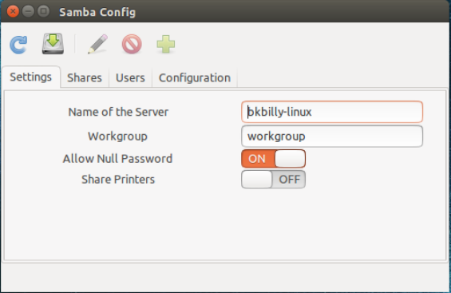
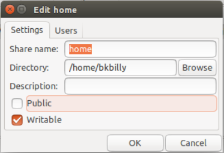
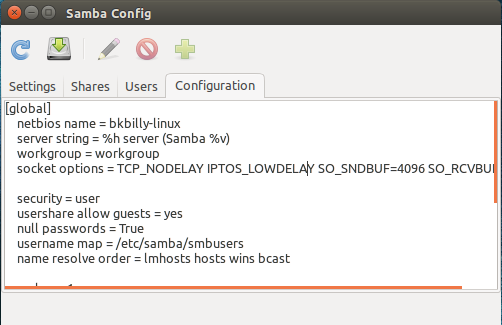

# README #

This is a Samba Configuration with GUI for linux which support for GTK+

#### Dependencies ####
sudo apt-get install samba
sudo apt-get install glade

### Run ###
python run.py

### Images ###

